# _Food Junkies_
> An application that helps user's use ingridients they have in their fridge or pantry.
> Live demo [_here_](https://zdensamson.github.io/food_junkies/). 

## Table of Contents
* [Technologies Used](#technologies-used)
* [APIs Used](#apis-used)
* [Features](#features)
* [Screenshot](#screenshot)
* [Project Status](#project-status)
* [Room for Improvement](#room-for-improvement)

## Technologies Used
- Tech 1 - HTML
- Tech 2 - CSS
- Tech 3 - Skeleton
- Tech 4 - Javascript
- Tech 5 - jQuery

## APIs Used
- API 1 - [_TheMealDB_](https://www.themealdb.com/api.php)
- API 2 - [_Foodish_](https://github.com/surhud004/Foodish#readme)

## Screenshot
### Food Junkies:
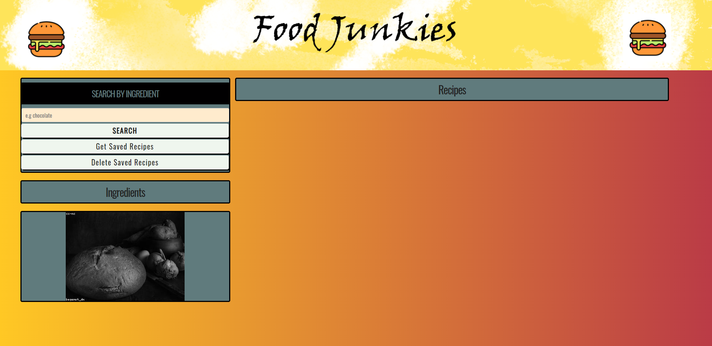

## Features
Ready Features:
1. **Show possible recipes according to the ingredient the user searches**
- Allows to view the recipes ingredients and measures according to the specific ingredient the user searches for.
       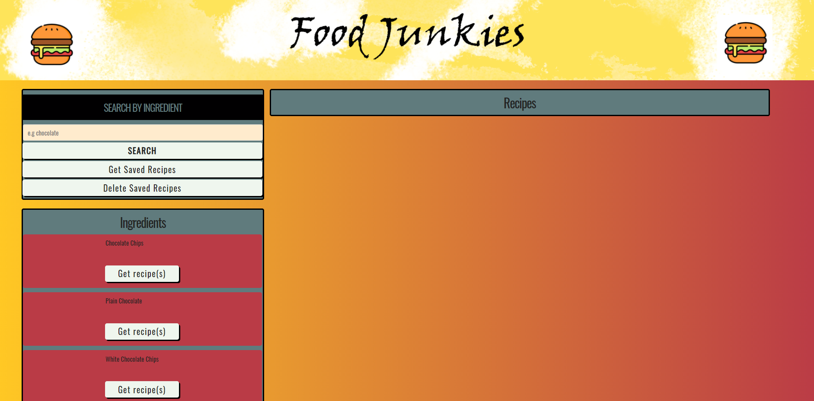
       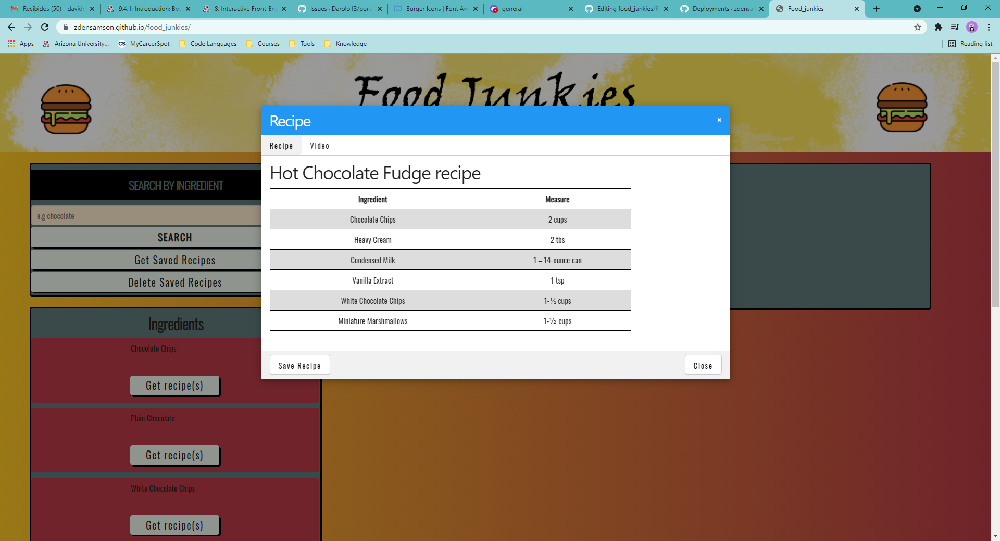

2. **Allows the user to select the amount of recipes he wants to be displayed**
- In case there is a great amount of recipes including the ingredient the users wants to use, the user will have the ability to select how many recipes he wants to be displayed.      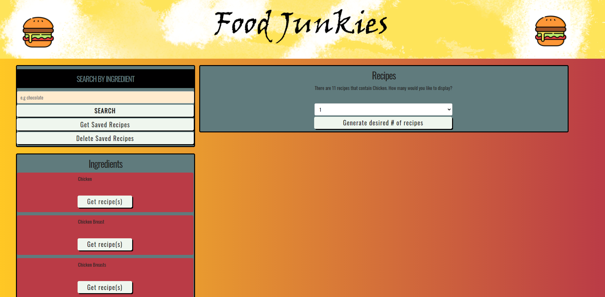

3. **Youtube recipe tutorials**
- Allows the user to view a youtube video that shows how to make the recipe he chooses step by step.
    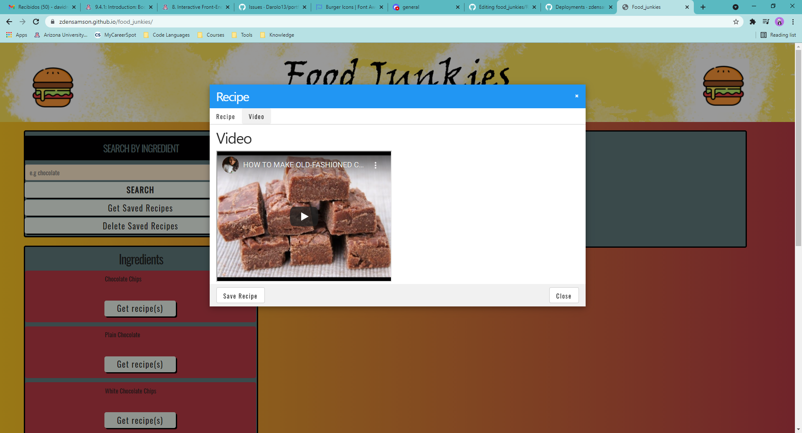
    
4. **Display random food image each time the user refreshes the page**    

5. **Validate ingredient** 
- In case the ingredient the users searched for isn't available, they will get a message displaying: "There are no recipe's in our database with <ingredient>."
    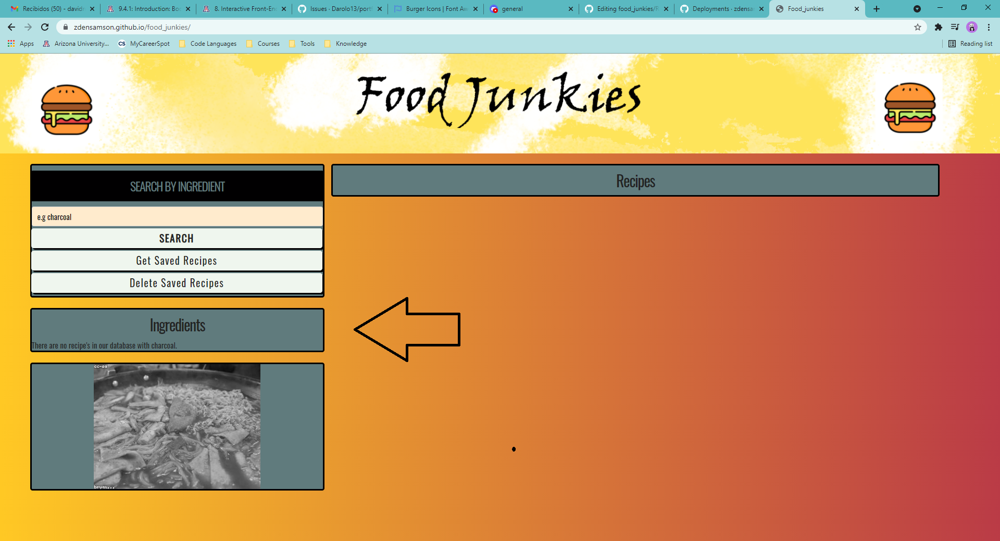

6. **Validate Recipes**
- In case the recipe the users select isn't available, they will get a message displaying: "There are presently no recipes including <ingredient>."
    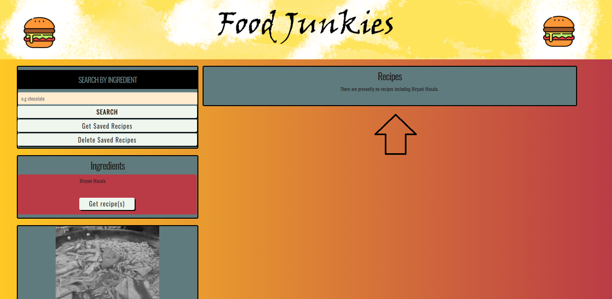    
    
7. **Allows to save the recipes the user likes**
- Allows the user to save the recipe by clicking save.
    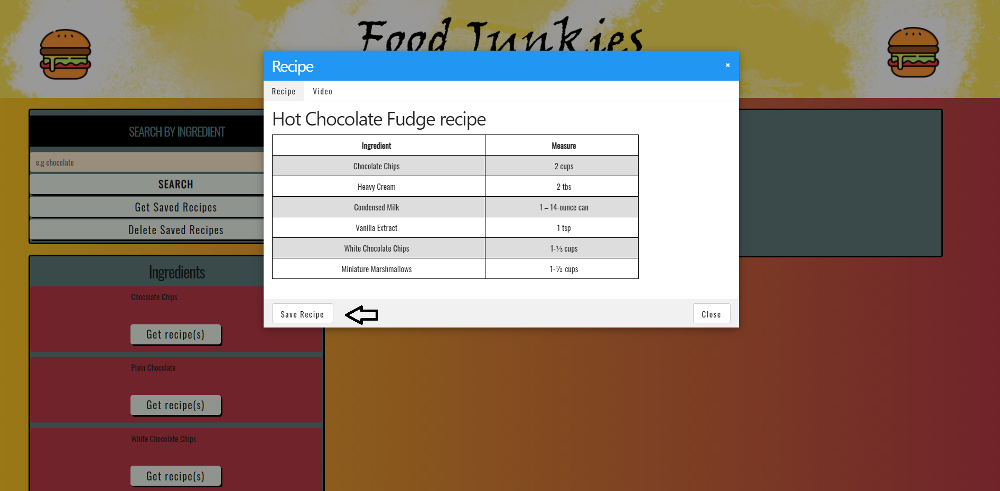
    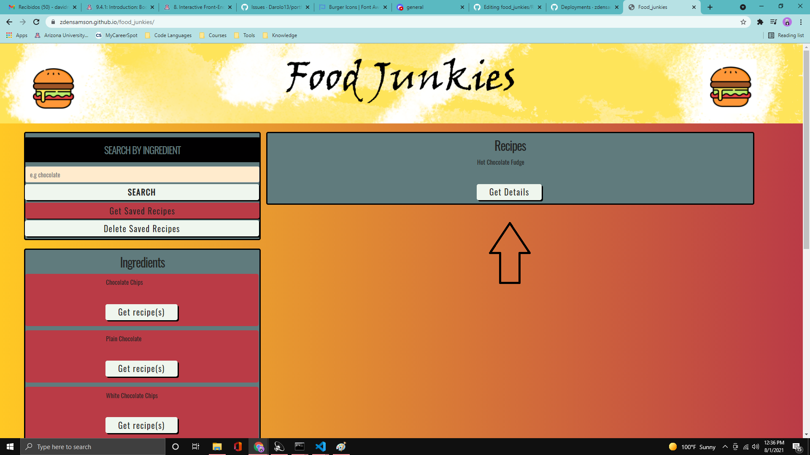

8. **Allows to unsave the recipes the user doesn't want stored anymore**
    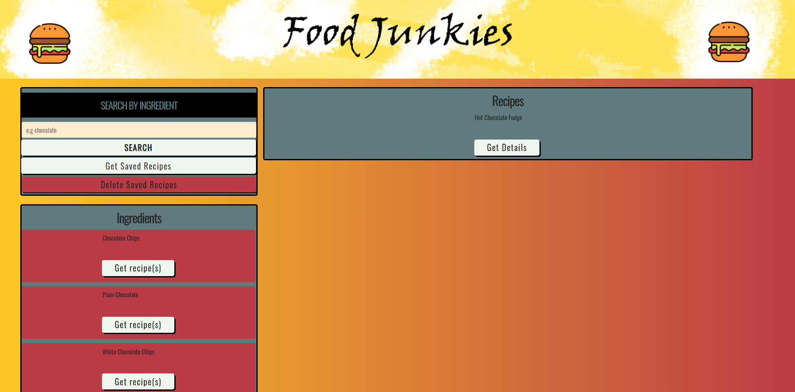
    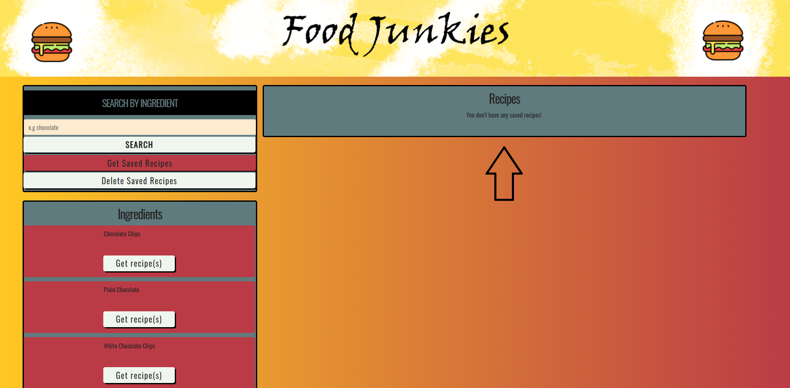

## Project Status
Project is: _in progress_

## Room for Improvement
Room for improvement:
- TBD

To do:
- Add an API that will allow the user to listen to music while they cook the recipe they decided to use.
